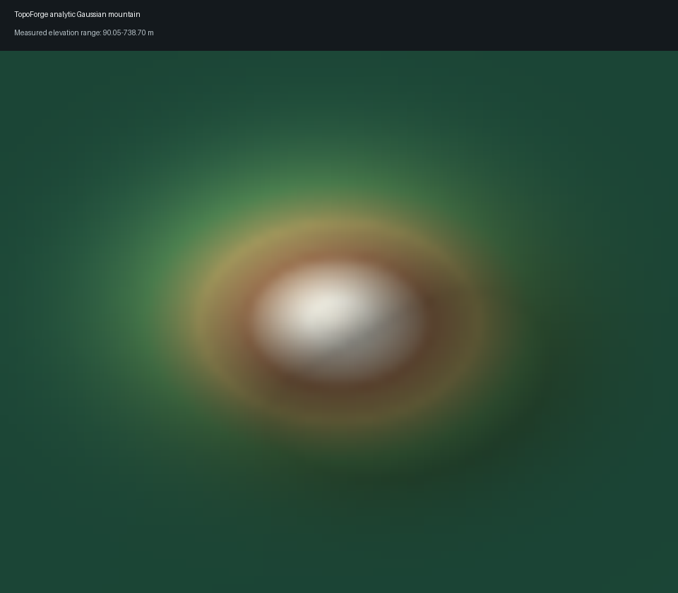

# TopoForge

TopoForge is a Python 3.12 CLI-first engine that converts georeferenced elevation rasters into dimensionally controlled terrain solids for additive manufacturing. It preserves CRS, terrain semantics, vertical-datum status, source checksums, NoData masks, interpolation fractions, physical scale, and validation evidence.

**Implemented milestone:** validated full-raster local GeoTIFF/synthetic manufacturing core, including deterministic 3MF/provenance and real slicing. Explicit AOI cropping, global providers, geocoding, tiling/connectors, API, and Web remain on the authoritative roadmap in `.agent/PLANS.md`.



## Verified output

The repository's executed synthetic Gaussian-mountain build produced:

| Measurement | Result |
| --- | --- |
| Model dimensions | `180.0 x 144.0 x 42.0 mm` |
| Terrain triangles | `20,476` |
| Watertight / manifold / winding | `true / true / true` |
| Connected components | `1` |
| Degenerate / duplicate faces | `0 / 0` |
| Bottom planarity error | `0.0 mm` |
| 3MF writer / strict reread | `lib3mf 2.5.0 / 0 warnings` |
| Actual slicer | `PrusaSlicer 2.4.0`, exit `0` |
| Slice result | `140` layers, `5,030,602` bytes G-code |
| Estimated print time | `7h 11m 41s` |
| Filament | `40,552.39 mm` / `97.54 cm3` |

The committed evidence copies are under `artifacts/reports/`; manufacturing files and G-code remain ignored under `outputs/` and `artifacts/slicer/`.

## Install

```bash
python3.12 -m pip install uv
uv sync
uv run topoforge doctor
```

The lock includes Rasterio/GDAL, PyProj, NumPy, SciPy, Trimesh, Pillow, Pydantic, Typer, and the official `lib3mf==2.5.0` binding.

## Build a local GeoTIFF

```bash
uv run topoforge build \
  --dem data/input.tif \
  --size-mm 200 0 \
  --vertical-scale fit-height \
  --max-height-mm 45 \
  --base-mm 3 \
  --printer-profile bambu-p2s-0.4 \
  --dataset-type dtm \
  --vertical-datum unknown \
  --data-license "DATASET LICENSE" \
  --attribution "DATASET ATTRIBUTION" \
  --output outputs/local-dem
```

A depth of `0` preserves the raster aspect ratio. An explicit depth that conflicts with the geographic aspect ratio is rejected rather than applying hidden horizontal distortion.

## Reproduce the synthetic milestone

```bash
uv run topoforge synthetic \
  --output examples/synthetic/gaussian-hill.tif \
  --terrain gaussian-hill --rows 64 --columns 80 --pixel-size-m 10

uv run topoforge build \
  --dem examples/synthetic/gaussian-hill.tif \
  --size-mm 180 0 --base-mm 3 --max-height-mm 42 \
  --vertical-scale fit-height \
  --printer-profile bambu-p2s-0.4 \
  --dataset-type dtm \
  --dataset-name "TopoForge analytic Gaussian mountain" \
  --dataset-version "milestone-01-fixture-v1" \
  --acquisition-period "deterministic analytic fixture" \
  --vertical-datum synthetic-local-zero \
  --data-license "Apache-2.0 synthetic fixture" \
  --attribution "TopoForge deterministic analytic fixture" \
  --output outputs/milestone-01-synthetic
```

Each completed build emits and reopens:

```text
model.stl
model.3mf
preview.glb
processed_dem.tif
original_nodata_mask.tif
provenance.json
validation.json
validation.html
build_config.resolved.yaml
build_manifest.json
preview.png
```

## Slice the manufacturing model

```bash
uv run topoforge slice \
  outputs/milestone-01-synthetic/model.3mf \
  --output artifacts/slicer/milestone-01.gcode
```

Discovery prefers OrcaSlicer and falls back to PrusaSlicer. A successful slice is attached to `validation.json`, `provenance.json`, `build_manifest.json`, and `slicer_validation.json` in the build bundle.

## CLI

```text
topoforge build       local GeoTIFF to complete artifact bundle
topoforge synthetic   deterministic analytic GeoTIFF fixtures
topoforge inspect     raster/STL/GLB/3MF measurements
topoforge validate    reopened STL geometry report
topoforge slice       actual OrcaSlicer/PrusaSlicer invocation
topoforge preview     bundle verification and preview paths
topoforge providers   provider semantics and implementation state
topoforge cache       cache status
topoforge doctor      Python/GDAL/PROJ/slicer versions
```

## Correctness policy

- Geographic rasters are reprojected to a north-up metric CRS before mesh construction.
- Rotated raster corner gaps are cropped to the largest source-covered rectangle.
- Only bounded interior NoData holes are interpolated; the original binary mask is saved.
- Horizontal scale is aspect-preserving and explicit in `provenance.json`.
- Robust relief selects the vertical policy, while absolute extrema enforce the hard model-height limit.
- Sea-level/custom baseline offsets survive mesh construction as absolute manufacturing Z coordinates.
- The mesh is constructed as an explicit top grid, perimeter walls, and flat bottom in millimetres.
- STL is reopened with coordinate welding; 3MF is strict-read with lib3mf and independently inspected as OPC/XML.
- Exhaustive self-intersection remains `not_fully_checked` when no robust backend is available.

## Quality gates

```bash
uv run ruff check .
uv run ruff format --check .
uv run pyright
uv run pytest
```

The 71-test suite covers analytic surfaces, CRS reprojection, rotated GeoTIFFs, NoData policies, resource downsampling, baseline/height contracts, YAML/CLI overrides, manifest tamper detection, deterministic STL/3MF/GLB, property-based arbitrary heightfields, provider registry semantics, slicer parsers/adapters, and an actual PrusaSlicer run.

## Documentation

- `docs/architecture.md`
- `docs/data-sources.md`
- `docs/3mf-research.md`
- `docs/terrain-semantics.md`
- `docs/provenance.md`
- `docs/printing.md`
- `docs/provider-development.md`

## Licenses

TopoForge code and synthetic fixtures are Apache-2.0. Elevation dataset terms stay separate; see `DATA_LICENSES.md` and each generated `provenance.json`. External slicers are separately installed AGPL-3.0 programs and are not redistributed by this repository.
